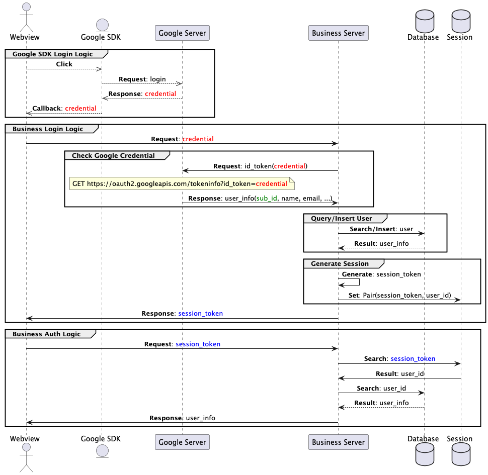

+++
title = "2024 12 26 Google Oauth 前后端接入流程"
date = "2024-12-26T00:05:36+08:00"
author = "leojin"
tags = ["开发"]
keywords = ["谷歌登录", "Oauth"]
description = "介绍接入Google Oauth登录的关键流程，及所需申请的物料，以实现网页端用户登录"
showFullContent = false
readingTime = false
hideComments = false
color = "" #color from the theme settings
+++

# 一、整体流程


# 二、物料准备

## 1、Google Oauth Client

- 目标：获取到`Client ID`和`Client Secret`。
- 官方文档：[Oauth2](https://developers.google.com/identity/protocols/oauth2)
- AI参考：[ChatGPT：GCP OAuth 登录集成](https://chatgpt.com/share/676d7aa9-aad4-8010-beff-e1ad2fe45976)
- 入口：[Google Cloud Platform](https://console.cloud.google.com/)
  - 进入`APIs & Services`
  - 进入`Credentials`，点击`Create credentials`，选择`OAuth client ID`


## 2、Google Console Search

- 目标：证明网站所有权，用于通过Oauth发布到生产环境的平台审核。
- 入口：[Google Search Console](https://search.google.com/search-console)

# 三、关键开发项

## 1、 前端SDK接入

- 效果：
- 依赖：`Oauth Client ID`
- 参考：[@react-oauth/google](https://www.npmjs.com/package/@react-oauth/google)

```jsx
import {GoogleOAuthProvider, GoogleLogin} from '@react-oauth/google';

const GoogleLoginComponent = () => {
    const onSuccess = async (response) => {
        console.log(response);
    }
    return (
        <GoogleOAuthProvider clientId="Your Oauth ClientID">
            <GoogleLogin
                onSuccess={onSuccess}
            />
        </GoogleOAuthProvider>
    );
};
```

## 2、 服务端接口

- 接收参数
  - `idToken`：前端从SDK获取的`Credentials`
- 验证`Credentials`，请求`https://oauth2.googleapis.com/tokeninfo`
  - 接口文档：[官方](https://cloud.google.com/docs/authentication/token-types?hl=zh-cn#id)
  - 返回主要信息：
    - `sub`：用户ID（可做为身份识别ID）
    - `name`：用户名称
    - `picture`：用户头像
    - `given_name`：用户名
    - `family_name`：用户姓氏
    - `email`：用户邮箱
    - `email_verified`：邮箱是否验证
    - `aud`：Oauth Client ID（需校验）
    - `exp`：过期时间
- 新老用户逻辑：根据`sub`查询用户，如果不存在则创建新用户
- Session处理：返回业务登录凭据

# 四、开发&发布

## 1、 开发测试
在[Google Auth Platform/Client ID for Web application](https://console.cloud.google.com/auth/clients)中修改`Authorized JavaScript origins`，填写本地开发环境和测试环境的地址（支持http://127.0.0.1:xxxx）

## 2、 发布正式
在[Google Auth Platform/Audience](https://console.cloud.google.com/auth/audience)中，切换到`Production`，提交审核，审核通过后即可上线使用。
审核期间如有问题，会有邮件通知（体验很快，1天内就给了反馈），根据邮件提示修改即可。

